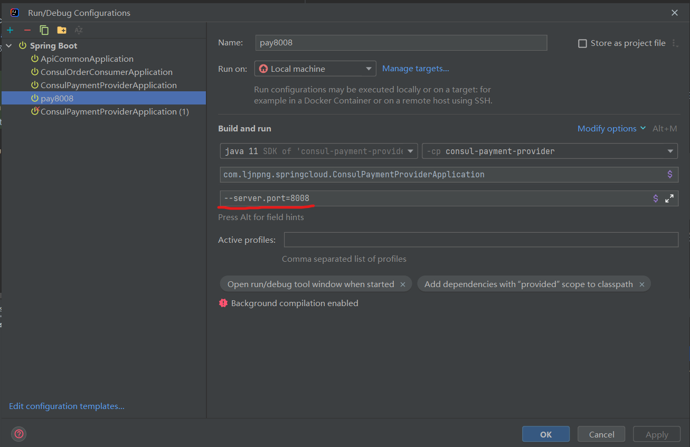
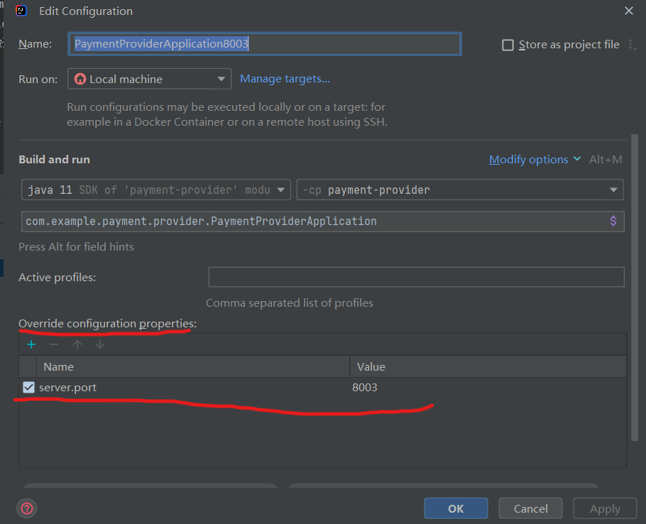

# Spring Cloud 系列的 demo

## 一个服务如何启动多个实例
主要就是通过设置java参数来覆盖application.yaml上的端口，如果有其他参数需要变化，也可以一起指定，  
如果参数过多的话，应该也可以指定特定的application.yaml 文件 #todo
- 如果是部署在服务器或者容器上的话，那肯定是打包好的
  ```shell
  # 打包 
  mvn package -DskipTests
  # 在服务器上运行 需要注意这个参数是java的入参(main 方法中的args)，而不是 vm参数
  java -jar xxx.jar --server.port=8080
  ```
- idea中也可以通过复制configuration 并通过参数覆盖application.yaml 中定义好的端口.  
如果没有输入框需要提前在 Modify Options 中把 Program arguments 勾选上  
  
- idea 另一种 `Override Configuration Properties` 同样也可以覆盖 application.yaml 中配置的参数
  

## zookeeper
[zookeeper-readme](zk/readme.md)